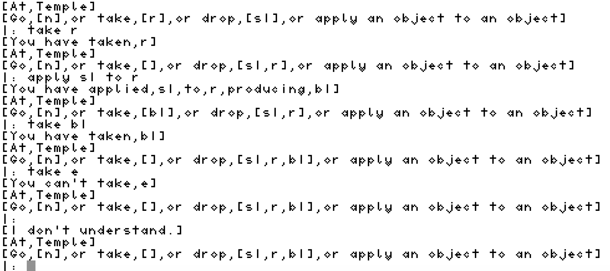

# Vetusia
A Text Adventure Game

# Getting Started

After downloading this repository and navigating to the Philosophy/philosophy/Theology folder:

* Download and run swipl.

# Rainforest
A single level (not Vetusia) in which the algorithm eventually finds the exit.
* Enter:
`['theology3.7.1.pl'].`
`traverse(2,6).`
where 2,6 are the starting co-ordinates.
```
[2,6][]
[2,5][]
[3,5][]
[3,4][]
[3,3][]
[2,3][]
[2,2][]
[3,2][v]
[4,4][v]
[4,5][v,c]
[3,6][v,c,k,m,e]
Game Over
% Execution Aborted
```
This is where:
* key to chest->machete
* machete to vine->exit

# Rainforest 3D
Multiple levels (not Vetusia) in which the algorithm eventually finds the exit.
* Enter:
`['theology3.7.1.2.pl'].`
`traverse(2,2,6).`
where z,x,y=2,2,6 are the starting co-ordinates.
```
[2,2,6][]
[2,2,5][]
[2,3,5][]
[2,3,4][]
[2,3,3][]
[2,2,3][]
[2,2,2][]
[2,3,2][]
[3,3,2][v]
[3,3,3][v]
[3,2,3][v]
[3,2,4][v]
[3,3,4][v]
[3,4,4][v]
[3,4,5][v]
[3,3,5][v]
[3,2,5][v]
[3,2,6][v]
[3,3,6][v]
[2,3,6][v,k]
[2,3,7][v,k]
[2,3,8][v,k]
[2,4,8][v,k]
[3,4,8][v,k]
[3,3,8][v,k]
[3,2,7][v,k]
[2,4,5][v,k,c,m,e]
Game Over
% Execution Aborted
```
This is where the items are the same as above.

# Vetusia Verifier
Multiple levels (Vetusia) in which the algorithm eventually finds the exit.
* Enter:
`['theology3.7.1.3_vetusia3d.pl'].`
`traverse(5,14,16).`
where z,x,y=5,14,16 are the starting co-ordinates.
```
[5,14,16][]
[5,13,16][]
[5,12,16][]
[5,12,15][]
[5,12,14][]
[5,11,14][]
[5,11,13][]
[5,11,12][r]
[5,13,14][r]
[5,14,14][r]
[5,14,13][r,m]
[5,14,12][r,m]
[6,14,12][r,m]
[7,14,12][r,m]
[7,14,11][r,m]
[7,14,10][r,m]
[7,13,10][r,m]
[7,12,10][r,m]
[8,12,10][r,m]
[9,12,10][r,m]
[9,11,10][r,m,s2]
[9,12,9][r,m,s2]
[9,12,8][r,m,s2]
[9,11,8][r,m,s2]
[8,11,8][r,m,s2]
[7,11,8][r,m,s2]
[7,10,8][r,m,s2]
[7,9,8][r,m,s2]
[7,8,8][r,m,s2]
[7,10,7][r,m,s2]
[7,10,6][r,m,s2]
[7,10,5][r,m,s2]
[7,9,5][r,m,s2]
[7,8,5][r,m,s2]
[7,8,6][r,m,s2,k]
[7,9,4][r,m,s2,k]
[7,9,3][r,m,s2,k]
[7,8,3][r,m,s2,k]
[6,8,3][r,m,s2,k]
[5,8,3][r,m,s2,k]
[5,8,4][r,m,s2,k]
[5,8,5][r,m,s2,k]
[5,9,5][r,m,s2,k]
[5,10,5][r,m,s2,k]
[5,10,6][r,m,s2,k]
[5,11,6][r,m,s2,k]
[5,12,6][r,m,s2,k]
[5,12,5][r,m,s2,k]
[5,12,4][r,m,s2,k]
[5,12,3][r,m,s2,k]
[5,11,3][r,m,s2,k]
[5,10,3][r,m,s2,k]
[5,10,7][r,m,s2,k]
[5,10,8][r,m,s2,k]
[5,9,8][r,m,s2,k]
[5,8,8][r,m,s2,k]
[5,8,7][r,m,s2,k]
[4,8,7][r,m,s2,k]
[3,8,7][r,m,s2,k]
[3,8,8][r,m,s2,k]
[3,8,9][r,m,s2,k]
[3,7,9][r,m,s2,k]
[3,6,9][r,m,s2,k]
[3,6,8][r,m,s2,k]
[3,6,7][r,m,s2,k]
[3,6,10][r,m,s2,k]
[3,6,11][r,m,s2,k]
[3,5,11][r,m,s2,k]
[3,4,11][r,m,s2,k]
[2,4,11][r,m,s2,k]
[1,4,11][r,m,s2,k]
[1,4,10][r,m,s2,k]
[1,4,9][r,m,s2,k]
[1,5,9][r,m,s2,k]
[1,6,9][r,m,s2,k,c]
[1,5,11][r,m,s2,k,c]
[1,6,11][r,m,s2,k,c]
[3,6,12][r,m,s2,k,c]
[3,6,13][r,m,s2,k,c]
[3,5,13][r,m,s2,k,c]
[3,4,13][r,m,s2,k,c]
[3,3,13][r,m,s2,k,c]
[3,2,13][r,m,s2,k,c]
[3,2,12][r,m,s2,k,c]
[3,2,11][r,m,s2,k,c]
[3,2,10][r,m,s2,k,c]
[3,2,9][r,m,s2,k,c]
[3,2,8][r,m,s2,k,c]
[3,2,7][r,m,s2,k,c]
[3,3,7][r,m,s2,k,c]
[3,4,7][r,m,s2,k,c]
[3,3,9][r,m,s2,k,c]
[3,4,9][r,m,s2,k,c]
[3,7,13][r,m,s2,k,c]
[3,8,13][r,m,s2,k,c]
[3,8,12][r,m,s2,k,c]
[3,8,10][r,m,s2,k,c]
[5,11,8][r,m,s2,k,c]
[5,12,8][r,m,s2,k,c]
[7,10,3][r,m,s2,k,c]
[7,11,3][r,m,s2,k,c]
[7,12,3][r,m,s2,k,c]
[7,12,4][r,m,s2,k,c]
[7,12,5][r,m,s2,k,c]
[7,12,6][r,m,s2,k,c]
[7,11,6][r,m,s2,k,c]
[7,10,4][r,m,s2,k,c]
[7,12,8][r,m,s2,k,c]
[7,14,9][r,m,s2,k,c]
[7,14,8][r,m,s2,k,c]
[5,14,15][r,m,s2,k,c]
[5,13,15][r,m,s2,k,c]
[5,12,17][r,m,s2,k,c]
[5,12,18][r,m,s2,k,c]
[5,11,18][r,m,s2,k,c]
[5,13,18][r,m,s2,k,c,s1,b1,b2,b3,b4,e]
Game Over
% Execution Aborted
```
This is where:
* s1 scroll to r rope -> b1 box 1
* b1 box 1 to m machete -> b2 box 2
* b2 box 2 to s2 scuba diving equipment -> b3 box 3
* b3 box 3 to k key -> b4 box 4
* b4 box 4 to c crystal statuette -> e exit

# Vetusia User Interface
Multiple levels (Vetusia) in which it is the goal of the human player to find the exit.
* Enter:
`['vetusia_ui.pl'].`
`vetusia.`

```
Key
0 - start

rainforest floor 5

15x19
         *****
         * s1*
         ** ***
          *  0*
         ** * *
         *    *
         * **m*
         *r**A*
|  F     ******
           B  |
              |
          C   |
       E      |
              |
              |
              |
       D      |
              |
              |
rainforest canopy 7

   ***
   *A*
 *** *
 *B  *
 *** *
   * *
   ***
 
 rainforest canopy 9
 
 ****
 *sB*s is s2
 ** *
 *C *
 ****
 
 underwater maze 7
 
 *******
 *   C *
 *** ***   
 *k*   *
 *   * *
 *** * *
 *D    *
 *******
 
 underwater maze 5

 *******
 *     *
 *E* ***   
 ***   *
 *   * *
 * *** *
 *D*   *
 *******
 
 underground pyramid 3
 
 *********
 *       *
 * *** * *
 * *F  ***
 * *** * *
 *   *   *
 * *** * *
 *   * *E*
 *********

 underground pyramid 1
 
 *****
 *F  *
 * ***
 *  c*
 *****
```
This is where the items are the same as above.

* Example game play screenshot


* You may go north, east, south, west, up and down, take, drop and apply objects to other objects.

# Authors

Lucian Green - Initial programmer - <a href="https://www.lucianacademy.com/">Lucian Academy</a>

# License

I licensed this project under the BSD3 License - see the <a href="LICENSE">LICENSE.md</a> file for details

